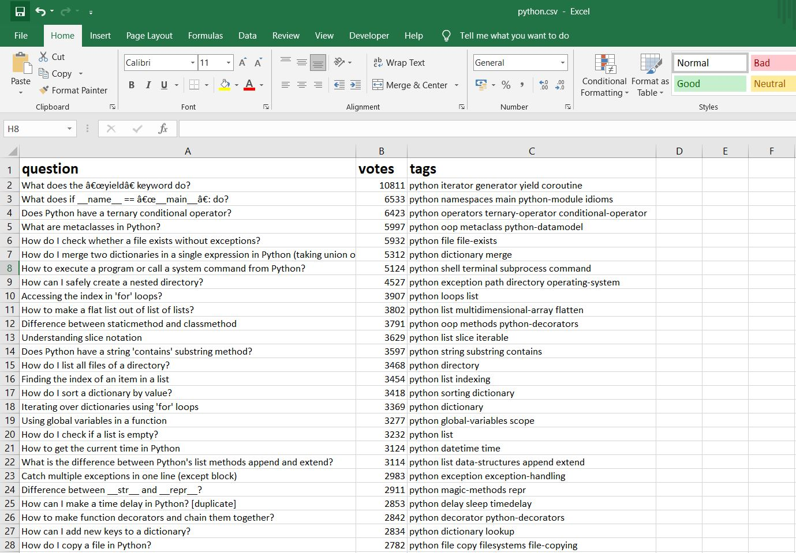

## **Stack Overflow Question Scraper**
This scrapper scrapes the questions from the stack overflow depending upon the number of votes, newest, active , no of question, no of pages to search and the field in which you want to search the question(topic).

##### Level: Beginner

<h3>Topics -> requests, requests-html, pandas, scraping, scripting, StackOverflowScraper</h3>
<h5>Preview Link -> <u><a href="https://drive.google.com/file/d/1HATnEAczmo3SlCD1ctq8nfH_QU0Mw-xc/preview">StackOverflowScraper</a></u></h5>
<h5>Source Code Link -> <u><a href="https://github.com/chaudharypraveen98/StackOverflowScraper">GitHub</a></u></h5>
<iframe src="https://drive.google.com/file/d/1HATnEAczmo3SlCD1ctq8nfH_QU0Mw-xc/preview" width="640" height="480" allow="autoplay"></iframe>
<strong>What We are going to do?</strong>
<ol>
    <li>First, we made a request to fetch the html page using the requests library</li>
    <li>If the response is OK , then we feed into the HTML parser from requests-HTML</li>
    <li>We will then use the selectors to get the required fields like question title, tag , votes and answered.</li>
</ol>
## libraries Required : - 
<ol>
    <li>Request-html</li>
    <li>Pandas</li>
    <li>Request library</li>
</ol>
## Prerequisites  

<strong>What are selectors/locators?</strong>
A CSS Selector is a combination of an element selector and a value which identifies the web element within a web page.

<b>The choice of locator depends largely on your Application Under Test</b>


<b>Id</b>
An element’s id in XPATH is defined using: “[@id='example']” and in CSS using: “#” - ID's must be unique within the DOM.
Examples:
`
XPath: //div[@id='example']
CSS: #example
`

<b>Element Type</b>
The previous example showed //div in the xpath. That is the element type, which could be input for a text box or button, img for an image, or "a" for a link. 

`
Xpath: //input or
Css: =input
`

<b>Direct Child</b>
HTML pages are structured like XML, with children nested inside of parents. If you can locate, for example, the first link within a div, you can construct a string to reach it. A direct child in XPATH is defined by the use of a “/“, while on CSS, it’s defined using “>”. 
Examples:
`                        
XPath: //div/a
CSS: div > a
`

<b>Child or Sub-Child</b>
Writing nested divs can get tiring - and result in code that is brittle. Sometimes you expect the code to change, or want to skip layers. If an element could be inside another or one of its children, it’s defined in XPATH using “//” and in CSS just by a whitespace.
Examples:
```
XPath: //div//a
CSS: div a
```

<b>Class</b>

For classes, things are pretty similar in XPATH: “[@class='example']” while in CSS it’s just “.” 
Examples:
```
XPath: //div[@class='example']
CSS: .example
```

## Understanding the code : - 
## Requesting the html webpage  

We will using the requests library to fetch the html code 
```
def extract_from_url(url):
r = requests.get(url)
if r.status_code not in range(200, 299):
print("error")
return "error while finding the data"
```
<b>r.status_code</b> will check the response status code. If it is valid then proceed to other part.
## Parsing the Html code using HTML from requests-HTML
```
html_text = r.text
formatted_html = HTML(html=html_text)
```

## Scraping using the parsed HTML code  
```
data_summary = formatted_html.find(".question-summary")
data = []
classes_needed = ['.vote-count-post', '.question-hyperlink']
final_data = []
for question in data_summary:
question_votes = question.find('.vote-count-post', first=True).text
question_data = question.find('.question-hyperlink', first=True).text
question_tags = question.find('.tags', first=True).text
data = {}
data["question"] = question_data
data["votes"] = question_votes
data["tags"] = question_tags
final_data.append(data)
return final_data
```
First we find the question container that contains whole information. We had used the class css selector (.question-summary)
Then, we loop through all the question container.We can easily extract other details using the css selector like
<ul>
    <li>('.vote-count-post') selector for votes</li>
    <li>('.question-hyperlink') selector for question link</li>
    <li>('.tags') selector for getting all the tags for the question</li>
</ul>

## Starting Scraper and Saving data into CSV format

```
def scrape_stack(tag="python", page=1, pagesize="20", sortby="votes"):
    base_url = "https://stackoverflow.com/questions/tagged/"
    all_page_data = []
    # iterating through each pages
    for i in range(1, page + 1):
    url = f"{base_url}{tag}?tab={sortby}&page={i}&pagesize={pagesize}"
    all_page_data += extract_from_url(url)
    df = pd.DataFrame(all_page_data)
    df.to_csv(f"{tag}.csv", index=False)
```

To scrap the Stack Overflows Question , We have 4 keyword argument
scrape_stack(tag="python", page=1, pagesize="20", sortby="votes")
where
<ol>
    <li><b>tag</b> : Field you want to search like c, javascript, html etc.</li>
    <li><b>page</b> : How many pages you want to search.</li>
    <li><b>pagesize</b> : How much questions or thread each page contains.</li>
    <li><b>sortby</b> : You can sort the question according to votes,newest,active and unanswered.</li>
</ol>
if argument are passed then we made the url according to it, otherwise we will use the default arguments.
Once the scraping is done, we load that data into pandas dataframe. Once we are able to make dataframe, then we can easily export the data into .csv file.

## How to setup/run on local machine

<ol>

<li>First clone the repo by following command:- `git clone https://github.com/chaudharypraveen98/StackOverflowScraper.git`</li>

<li>Then you have to install all the required dependencies by following command :- `pip3 install -r requirements.txt`</li>

<li>Run the file in python interactive mode. Now you are ready to go. To scrap the Stack Overflows Question , type:-
`scrape_stack(tag="python", page=1, pagesize="20", sortby="votes")`</li>

</ol>

## Deployment

For deployment,  We are using the <strong>Repl</strong> or <strong>Heroku</strong> to deploy our localhost to web.<span><a href="https://replit.com/">For More Info</a></span>
## Web Preview / Output
<a href="questions.JPG"></a>

<span>Web preview on deployment</span>

Placeholder text by <a href="https://chaudharypraveen98.github.io/">Praveen Chaudhary</a>&middot; Images by <a href="hhttps://chaudharypraveen98.github.io/binarybeast/">Binary Beast</a></span>


_**Note**_: Any changes are most welcomed. By default the file extension is set to csv with the tag you used for scraping
